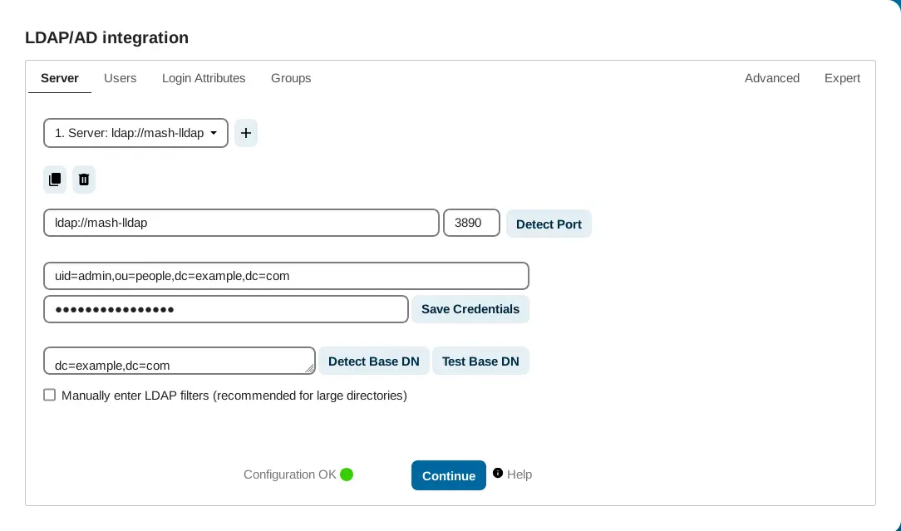

<!--
SPDX-FileCopyrightText: 2020 Aaron Raimist
SPDX-FileCopyrightText: 2020 Chris van Dijk
SPDX-FileCopyrightText: 2020 Dominik Zajac
SPDX-FileCopyrightText: 2020 Mickaël Cornière
SPDX-FileCopyrightText: 2020-2024 MDAD project contributors
SPDX-FileCopyrightText: 2020-2024 Slavi Pantaleev
SPDX-FileCopyrightText: 2022 François Darveau
SPDX-FileCopyrightText: 2022 Julian Foad
SPDX-FileCopyrightText: 2022 Warren Bailey
SPDX-FileCopyrightText: 2023 Antonis Christofides
SPDX-FileCopyrightText: 2023 Felix Stupp
SPDX-FileCopyrightText: 2023 Julian-Samuel Gebühr
SPDX-FileCopyrightText: 2023 MASH project contributors
SPDX-FileCopyrightText: 2023 Niels Bouma
SPDX-FileCopyrightText: 2023 Pierre 'McFly' Marty
SPDX-FileCopyrightText: 2024 Gergely Horváth
SPDX-FileCopyrightText: 2024 Thomas Miceli
SPDX-FileCopyrightText: 2024-2026 Suguru Hirahara

SPDX-License-Identifier: AGPL-3.0-or-later
-->

# Nextcloud

The playbook can install and configure [Nextcloud](https://nextcloud.com/) for you.

Nextcloud is the most popular self-hosted collaboration solution for tens of millions of users at thousands of organizations across the globe.

See the project's [documentation](https://docs.nextcloud.com/) to learn what Nextcloud does and why it might be useful to you.

For details about configuring the [Ansible role for Nextcloud](https://github.com/mother-of-all-self-hosting/ansible-role-nextcloud), you can check them via:

- 🌐 [the role's documentation](https://github.com/mother-of-all-self-hosting/ansible-role-nextcloud/blob/main/docs/configuring-nextcloud.md) online
- 📁 `roles/galaxy/nextcloud/docs/configuring-nextcloud.md` locally, if you have [fetched the Ansible roles](../installing.md)

## Dependencies

This service requires the following other services:

- [Postgres](postgres.md) / MySQL / [MariaDB](mariadb.md) / [SQLite](https://www.sqlite.org/) database — Nextcloud will default to SQLite if Postgres is not enabled
- [Traefik](traefik.md) reverse-proxy server
- (optional) a [Valkey](valkey.md) data-store; see [below](#configuring-valkey-optional) for details about installation
- (optional) [exim-relay](exim-relay.md) mailer

## Configuration

To enable this service, add the following configuration to your `vars.yml` file:

```yaml
########################################################################
#                                                                      #
# nextcloud                                                            #
#                                                                      #
########################################################################

nextcloud_enabled: true

nextcloud_hostname: mash.example.com
nextcloud_path_prefix: /nextcloud

# Valkey configuration, as described below

########################################################################
#                                                                      #
# /nextcloud                                                           #
#                                                                      #
########################################################################
```

### Select database to use (optional)

By default Nextcloud is configured to use [Postgres](postgres.md) (if enabled), but you can choose other databases such as MySQL (MariaDB) and SQLite. If Postgres is not enabled, SQLite will be used. See [this section](https://github.com/mother-of-all-self-hosting/ansible-role-nextcloud/blob/main/docs/configuring-nextcloud.md#configure-database) on the role's documentation for details.

### Configuring the mailer (optional)

On Nextcloud you can set up a mailer for functions such as password recovery. If you enable the [exim-relay](exim-relay.md) service in your inventory configuration, the playbook will automatically configure it as a mailer for the service.

To actually have the service use (and get messages sent through the exim-relay service), you will need to adjust settings on the service's UI after the service is installed.

>[!WARNING]
> Without setting an authentication method such as DKIM, SPF, and DMARC for your hostname, emails are most likely to be quarantined as spam at recipient's mail servers. The worst scenario is that your server's IP address or hostname will be included in the spam list such as the one managed by [Spamhaus](https://www.spamhaus.org/), depending on the reputation. As the exim-relay service supports DKIM signing, refer to [the role's documentation](https://github.com/mother-of-all-self-hosting/ansible-role-exim-relay/blob/main/docs/configuring-exim-relay.md#enable-dkim-support-optional) for details about how to set it up.

### Editing default configuration parameters (optional)

Some configuration parameters for Nextcloud can be specified with variables starting with `nextcloud_config_parameter_default_*`. See [this section](https://github.com/mother-of-all-self-hosting/ansible-role-nextcloud/blob/main/docs/configuring-nextcloud.md#editing-default-configuration-parameters-optional) on the role's documentation for details. Refer to [this page](https://docs.nextcloud.com/server/latest/admin_manual/configuration_server/config_sample_php_parameters.html) of the Nextcloud documentation as well.

### Configuring Valkey (optional)

Valkey can optionally be enabled to improve Nextcloud performance and to prevent file locking problems. This playbook supports it, and you can set up a Valkey instance by enabling it on `vars.yml`.

First choose the Valkey layout which matches your desired state:

- **No Valkey** — the simplest deployment. Though running Valkey is recommended, you can start without it. Continue at [Continue after choosing a Valkey layout](#continue-after-choosing-a-valkey-layout).
- **A dedicated Valkey instance** — recommended if another service uses or may later use Valkey. Sharing one instance between services has security concerns and may cause data conflicts, as described in [Configuring Valkey](valkey.md).
- **The shared Valkey instance** — reasonable when Nextcloud is the only service configured to use this instance, whether MASH-managed or not.

The practical transport rule is: **remote Valkey requires TCP, but TCP does not imply remote**. The recipes on this page cover these placements and connection modes:

| Valkey placement | Available connection modes | Covered here |
| --- | --- | --- |
| Same managed node | Unix socket (recommended) or TCP over a shared Docker network | Yes |
| Different managed node (remote) | TCP only | No; the endpoint must be made reachable and secured separately |

The same-node recipes use one of these alternative paths:

```text
one managed node (one Linux operating system and Docker host)
├─ host filesystem (Unix-socket path)
│  └─ socket directory bind-mounted into both containers
└─ Docker (TCP path)
   └─ shared container network
      ├─ Nextcloud container
      └─ Valkey container
```

A remote layout crosses additional layers:

```text
managed node A (Linux/Docker host)              managed node B (Linux/Docker host)
└─ Docker                                      └─ Docker
   └─ local container network                     └─ local container network
      └─ Nextcloud container ── secured TCP ─────────► Valkey container
```

Both TCP recipes below keep Nextcloud and Valkey on the same managed node. A remote endpoint must be made reachable and secured separately. To learn more about Nextcloud memory caching, see the [Nextcloud documentation](https://docs.nextcloud.com/server/latest/admin_manual/configuration_server/caching_configuration.html#id2).

#### Setting up a dedicated Valkey instance

To create a dedicated instance for Nextcloud, you can follow the steps below:

1. Adjust the `hosts` file
2. Create a new `vars.yml` file for the dedicated instance
3. Edit the existing `vars.yml` file for the main host

A **supplementary inventory host** is an additional Ansible inventory identity with its own `host_vars`; it can target the same managed node—the same server or VM—as the main inventory host. See [Inventory hosts and managed nodes](../running-multiple-instances.md#inventory-hosts-and-managed-nodes) for the full model and setup.

##### Adjust `hosts`

At first, adjust `inventory/hosts` to add a supplementary inventory host for Nextcloud's dedicated Valkey instance.

The content should be something like below. Make sure to replace `mash.example.com` with your hostname and `YOUR_SERVER_IP_ADDRESS_HERE` with the address of the managed node, respectively. This recipe targets one server or VM through two inventory hosts, so set the same `ansible_host` value for both.

```ini
[mash_servers]
[mash_servers:children]
mash_example_com

[mash_example_com]
mash.example.com ansible_host=YOUR_SERVER_IP_ADDRESS_HERE
mash.example.com-nextcloud-deps ansible_host=YOUR_SERVER_IP_ADDRESS_HERE
# Other inventory entries can follow
```

`mash_example_com` can be any valid Ansible inventory group name and does not need to match the server hostname.

You can just add an entry for the supplementary inventory host to `[mash_example_com]` if there are other entries there already.

##### Create `vars.yml` for the dedicated instance

Then, create a new directory where `vars.yml` for the supplementary inventory host is stored. If `mash.example.com` is your main inventory host, name the directory as `mash.example.com-nextcloud-deps`. Its path therefore will be `inventory/host_vars/mash.example.com-nextcloud-deps`.

After creating the directory, add a new `vars.yml` file inside it with the content below. Running the playbook for this supplementary inventory host will create a `mash-nextcloud-valkey` instance on the managed node, using `/mash/nextcloud-valkey` as its base directory.

```yaml
# Nextcloud dependencies - supplementary inventory host
#
# Inventory host: mash.example.com-nextcloud-deps
# Purpose: dedicated Valkey for Nextcloud
# Managed node: same server or VM targeted by mash.example.com

---

########################################################################
#                                                                      #
# Playbook                                                             #
#                                                                      #
########################################################################

# Put a strong secret below, generated with `pwgen -s 64 1` or in another way
mash_playbook_generic_secret_key: ''

# Override service names and directory path prefixes
mash_playbook_service_identifier_prefix: 'mash-nextcloud-'
mash_playbook_service_base_directory_name_prefix: 'nextcloud-'

########################################################################
#                                                                      #
# /Playbook                                                            #
#                                                                      #
########################################################################

########################################################################
#                                                                      #
# valkey                                                               #
#                                                                      #
########################################################################

valkey_enabled: true

########################################################################
#                                                                      #
# /valkey                                                              #
#                                                                      #
########################################################################
```

##### Edit the main `vars.yml` file

Having configured `vars.yml` for the dedicated instance, add exactly one of the following blocks to the existing `nextcloud` section in the main inventory host's `inventory/host_vars/mash.example.com/vars.yml` file (replace `mash.example.com` with yours).

Do not combine the two blocks. Both modes keep Nextcloud and Valkey on the same managed node: Unix socket mode uses the shared host filesystem, while TCP mode uses a shared Docker network. In Unix socket mode, omit `nextcloud_redis_hostname` and any dedicated-Valkey entry from `nextcloud_container_additional_networks_custom`; the role normalizes the effective socket port to `0`, so no port setting is needed. In TCP mode, omit `nextcloud_redis_socket_path_host`.

Unix socket mode:

```yaml
# Connect Nextcloud to its dedicated Valkey instance via the Unix domain socket
nextcloud_redis_socket_enabled: true
nextcloud_redis_socket_path_host: /mash/nextcloud-valkey/run

# Start Nextcloud after its dedicated Valkey service
nextcloud_systemd_required_services_list_custom:
  - "mash-nextcloud-valkey.service"
```

TCP mode:

```yaml
# Connect Nextcloud to its dedicated Valkey instance via TCP
nextcloud_redis_socket_enabled: false
nextcloud_redis_hostname: mash-nextcloud-valkey
nextcloud_redis_port: 6379

# Connect Nextcloud to the container network of its dedicated Valkey instance
nextcloud_container_additional_networks_custom:
  - "mash-nextcloud-valkey"

# Start Nextcloud after its dedicated Valkey service
nextcloud_systemd_required_services_list_custom:
  - "mash-nextcloud-valkey.service"
```

After adding one block, skip the shared recipe and [continue with the remaining configuration](#continue-after-choosing-a-valkey-layout). Running the playbook for the supplementary inventory host will create the dedicated Valkey instance named `mash-nextcloud-valkey`.

#### Setting up a shared Valkey instance

If Nextcloud is the only service configured to use the shared Valkey instance, whether MASH-managed or not, it is fine to set one up.

To install the single instance and hook Nextcloud to it, add the following configuration to `inventory/host_vars/mash.example.com/vars.yml`:

```yaml
########################################################################
#                                                                      #
# valkey                                                               #
#                                                                      #
########################################################################

valkey_enabled: true

########################################################################
#                                                                      #
# /valkey                                                              #
#                                                                      #
########################################################################
```

Then add exactly one of the following blocks to the existing `nextcloud` section. Do not combine the two blocks. In Unix socket mode, omit `nextcloud_redis_hostname` and any shared-Valkey entry from `nextcloud_container_additional_networks_custom`; the role normalizes the effective socket port to `0`, so no port setting is needed. In TCP mode, omit `nextcloud_redis_socket_path_host`.

Unix socket mode:

```yaml
# Connect Nextcloud to the shared Valkey instance via the Unix domain socket
nextcloud_redis_socket_enabled: true
nextcloud_redis_socket_path_host: "{{ valkey_run_path }}"

# Start Nextcloud after the shared Valkey service
nextcloud_systemd_required_services_list_custom:
  - "{{ valkey_identifier }}.service"
```

TCP mode:

```yaml
# Connect Nextcloud to the shared Valkey instance via TCP
nextcloud_redis_socket_enabled: false
nextcloud_redis_hostname: "{{ valkey_identifier }}"
nextcloud_redis_port: 6379

# Connect the Nextcloud container to the container network of the shared Valkey service
nextcloud_container_additional_networks_custom:
  - "{{ valkey_container_network }}"

# Start Nextcloud after the shared Valkey service
nextcloud_systemd_required_services_list_custom:
  - "{{ valkey_identifier }}.service"
```

Running the installation command will create the shared Valkey instance named `mash-valkey`.

#### Continue after choosing a Valkey layout

After choosing no Valkey or completing one of the two Valkey recipes, continue with any remaining optional configuration below and then proceed to [Installation](#installation).

### Samba (optional)

You can enable [Samba](https://www.samba.org/) external Windows fileshares using [smbclient](https://www.samba.org/samba/docs/current/man-html/smbclient.1.html). See [this section](https://github.com/mother-of-all-self-hosting/ansible-role-nextcloud/blob/main/docs/configuring-nextcloud.md#enable-samba-optional) on the role's documentation for details.

## Installation

If you chose a dedicated Valkey instance, run the [installation](../installing.md) separately for the supplementary inventory host before the main inventory host:

```sh
just install-all -l mash.example.com-nextcloud-deps
just install-all -l mash.example.com
```

Use `-l` as shown in [Installation](../running-multiple-instances.md#installation) to keep these as separate limited installations. Do not rely on an unscoped `just install-all` or `just setup-all` command to serialize them; Ansible may run inventory aliases which target the same managed node in parallel. If you chose the shared or no-Valkey layout, run the normal installation for the main inventory host.

## Usage

After the initial installation, run this command once before logging in:

```sh
just run-tags adjust-nextcloud-config
```

It applies settings which the role stores inside Nextcloud's persisted configuration, including URL and path settings, trusted proxies, Valkey and memory-cache settings, and values from `nextcloud_config_parameters_*`. Run it again after every Nextcloud version update and whenever you change one of these settings.

The Nextcloud instance is then available at the URL specified with `nextcloud_hostname` and `nextcloud_path_prefix`. With the configuration above, the service is hosted at `https://mash.example.com/nextcloud`.

### Changing or disabling Valkey

The Redis endpoint settings enable Nextcloud's Valkey integration, while `nextcloud_redis_socket_enabled` only selects how Nextcloud connects. The selector and `nextcloud_redis_port` have no effect when both `nextcloud_redis_hostname` and `nextcloud_redis_socket_path_host` are unset or empty.

When changing an existing configuration, first make the complete target state explicit:

- To use a Unix socket, use the complete socket block for your chosen Valkey setup, remove `nextcloud_redis_hostname`, and remove that Valkey instance from `nextcloud_container_additional_networks_custom` if the entry is no longer needed. The role always passes effective port `0` in socket mode; a leftover `nextcloud_redis_port` value is ignored, but removing a stale TCP-only override keeps the target state clear.
- To use TCP, use the complete TCP block for your chosen Valkey setup, remove `nextcloud_redis_socket_path_host`, and ensure `nextcloud_redis_port` resolves to the endpoint's TCP port. Remove a stale `0` override to use the default `6379`, or set the actual port.
- To stop using Valkey in Nextcloud, remove both endpoint settings and the corresponding Valkey entries from `nextcloud_container_additional_networks_custom` and `nextcloud_systemd_required_services_list_custom`.

The order depends on the target state:

#### Enabling Valkey or switching connection

After selecting a complete socket or TCP state, run the [installation](#installation) first and then run `just run-tags adjust-nextcloud-config`. The installation updates the container environment, mounts, networks, and systemd dependencies; the adjustment writes the matching Redis and memory-cache settings to Nextcloud's persisted configuration.

#### Disabling Valkey integration

Keep the old Valkey service and connection available while removing both endpoint settings and the related network and systemd entries from your inventory. These inventory edits do not change the existing container until you rerun the installation, so do not stop Valkey yet. Run `just run-tags adjust-nextcloud-config` first. This atomically removes Nextcloud's persisted `redis`, `memcache.distributed`, and `memcache.locking` settings while the existing container can still reach the old endpoint.

Only after that adjustment succeeds, rerun the [installation](#installation). This removes the Redis environment, socket mount, session configuration, network attachment, and systemd dependency from the Nextcloud container and service.

If the old endpoint became unavailable before the adjustment, restore its previous service, endpoint, and connection settings before retrying this sequence.

After completing the applicable two runs, use `just run-tags query-status-nextcloud` to verify that Nextcloud starts, then check Nextcloud's administration overview for cache or file-locking warnings. To roll back, restore the previous complete endpoint, network, and systemd settings, run the installation, and then run the configuration adjustment again.

Removing Nextcloud's integration settings does not disable or uninstall the Valkey service and does not delete its data. Keep a shared instance if another service uses it. Treat removal of an unused dedicated instance and its data as a separate lifecycle decision.

### Checking SMTP server configuration

The playbook automatically configures a SMTP server (Exim-relay), to which the Nextcloud instance connects to send emails. After logging in as the admin user, you can check the configuration at `https://mash.example.com/nextcloud/settings/admin` for basic administration settings.

Before sending a test mail, **make sure to set the email address of the admin user** at `https://mash.example.com/nextcloud/settings/user`. Otherwise hitting the "Send email" button on the page returns the 400 error, as the instance does not know where to send the mail. See the browser's console for details.

### Preview Generator

It is possible to set up preview generation. See [this section](https://github.com/mother-of-all-self-hosting/ansible-role-nextcloud/blob/main/docs/configuring-nextcloud.md#enable-preview-generator-app-optional) on the role's documentation for details about necessary steps to enable it.

### Single-Sign-On (SSO) integration

Nextcloud supports Single-Sign-On (SSO) via LDAP, SAML, and OIDC. To make use of it, an Identity Provider (IdP) like [authentik](authentik.md) or [Keycloak](keycloak.md) needs to be set up.

For example, you can enable SSO with authentik via OIDC by following the steps below:

- Create a new provider in authentik and trim the client secret to less than 64 characters
- Create an application in authentik using this provider
- Install the app `user_oidc` in Nextcloud
- Fill in the details from authentik in the app settings

Refer to [this blogpost by a third party](https://blog.cubieserver.de/2022/complete-guide-to-nextcloud-oidc-authentication-with-authentik/) for details.

💡 **Notes**:

- The official documentation of authentik to connect nextcloud via SAML does not seem to work (as of August 2023).
- If you cannot log in due to an error (the error message contains `SHA1 mismatch`), make sure that Nextcloud users and authentik users do not have the same name. If they do, check `Use unique user ID` in the OIDC App settings.

### LDAP integration with LLDAP

Nextcloud ships with an LDAP application to allow LDAP (including Active Directory) users to log in to the Nextcloud instance with their LDAP credentials. See [this section](https://github.com/mother-of-all-self-hosting/ansible-role-nextcloud/blob/main/docs/configuring-nextcloud.md#connecting-to-ldap-server) on the role's documentation for details about how to configure Nextcloud.

This playbook supports [LLDAP](https://github.com/lldap/lldap), and it is possible to set up the LLDAP instance as a source for users.

First, the LLDAP instance needs to be installed. See [this page](lldap.md) for the instruction.

Then, proceed to configure the LDAP application on the Nextcloud to have it connect to the LLDAP instance. By default the playbook is configured to use the user specified with `lldap_environment_variables_lldap_ldap_user_dn` for binding. To use another user (with search privileges), add the following configuration to your `vars.yml` file:

```yaml
nextcloud_ldap_agent_name_uid: USERNAME_FOR_BINDING_HERE
```

Run the command below to configure the LDAP application on the Nextcloud instance, so that the instance connects to the LLDAP server:

```sh
just run-tags set-ldap-config-nextcloud -e agent_password=PASSWORD_OF_BIND_USER_HERE
```

After running the command successfully, the application's server tab should look like below (note: `uid` is set to `admin`):

[](../assets/nextcloud/ldap.webp)

If "Configuration OK 🟢" is displayed at the bottom of the tab, the application is configured successfully, and now users on the LLDAP instance can log in to the instance with their LDAP credentials.

Refer to [this page](https://docs.nextcloud.com/server/latest/admin_manual/configuration_user/user_auth_ldap.html) on the Nextcloud admin manual for details about other configurations.

To disable the integration altogether (in case of using another LDAP server for Nextcloud while using LLDAP for other services, etc.), add the following configuration to your `vars.yml` file:

```yaml
nextcloud_lldap_enabled: false
```

### Configuring Nextcloud Office application

To use the [Nextcloud Office application](https://apps.nextcloud.com/apps/eurooffice), it is necessary to set up an [Euro-Office](https://github.com/Euro-Office/DocumentServer) instance. This playbook supports it, and you can set it up by enabling it on `vars.yml`. You can follow the [documentation](eurooffice.md) to install it.

By default, this playbook is configured to automatically integrate the Euro-Office instance with the Nextcloud instance which this playbook manages, if both of them are enabled.

After installing both Euro-Office and Nextcloud, run this command to install and configure the Nextcloud Office application:

```sh
just run-tags install-nextcloud-app-eurooffice
```

You should then be able to open any document (`.doc`, `.odt`, `.pdf`, etc.) and create new ones in Nextcloud Files with the Nextcloud Office application.

Open the URL `https://mash.example.com/nextcloud/settings/admin/eurooffice` to configure the application. Refer to [this page](https://github.com/Euro-Office/eurooffice-nextcloud/blob/main/README.md#common-settings) for details about available settings.

### Configuring Nextcloud Office (Collabora) application

To use the [Nextcloud Office (Collabora) application](https://apps.nextcloud.com/apps/richdocuments), it is necessary to set up a WOPI (Web Application Open Platform Interface) client such as [Collabora Online Development Edition (CODE)](https://www.collaboraonline.com/code/). This playbook supports CODE, and you can set up a CODE instance by enabling it on `vars.yml`. You can follow the [documentation](code.md) to install it.

By default, this playbook is configured to automatically integrate the CODE instance with the Nextcloud instance which this playbook manages, if both of them are enabled.

After installing both CODE and Nextcloud, run this command to install and configure the Nextcloud Office (Collabora) application:

```sh
just run-tags install-nextcloud-app-richdocuments
```

Open the URL `https://mash.example.com/nextcloud/settings/admin/richdocuments` to have the instance set up the connection with the CODE instance.

You should then be able to open any document (`.doc`, `.odt`, `.pdf`, etc.) and create new ones in Nextcloud Files with the Nextcloud Office (Collabora) application.

>[!NOTE]
> By default, several private IPv4 networks are whitelisted to connect to the WOPI API (document serving API). If your CODE instance does not live on the same server as Nextcloud, you may need to adjust the list of networks. If necessary, redefine the `nextcloud_app_richdocuments_wopi_client_allowlist` environment variable on `vars.yml`.

## Troubleshooting

See [this section](https://github.com/mother-of-all-self-hosting/ansible-role-nextcloud/blob/main/docs/configuring-nextcloud.md#troubleshooting) on the role's documentation for details.
