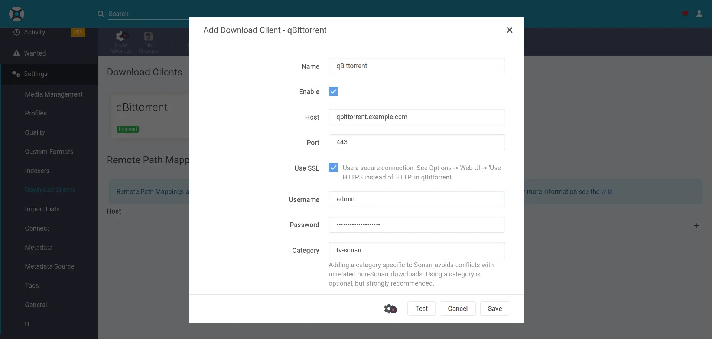

<!--
SPDX-FileCopyrightText: 2023 Alejandro AR
SPDX-FileCopyrightText: 2023 Nikita Chernyi
SPDX-FileCopyrightText: 2023, 2024 Julian-Samuel Gebühr
SPDX-FileCopyrightText: 2023, 2024 Sergio Durigan Junior
SPDX-FileCopyrightText: 2023-2025 MASH project contributors
SPDX-FileCopyrightText: 2023-2025 Slavi Pantaleev
SPDX-FileCopyrightText: 2024 Katherine Door
SPDX-FileCopyrightText: 2024 Oliver Lorenz
SPDX-FileCopyrightText: 2025 Gergely Horváth
SPDX-FileCopyrightText: 2025 XHawk87
SPDX-FileCopyrightText: 2025 spatterlight
SPDX-FileCopyrightText: 2025, 2026 Suguru Hirahara

SPDX-License-Identifier: AGPL-3.0-or-later
-->

# qBittorrent

The playbook can install and configure [qBittorrent](https://github.com/linuxserver/docker-qbittorrent) for you.

qBittorrent is a BitTorrent client programmed in C++ / Qt that uses libtorrent.

See the project's [documentation](https://docs.linuxserver.io/images/docker-qbittorrent/) to learn what qBittorrent does and why it might be useful to you.

## Dependencies

This service requires the following other services:

- [Traefik](traefik.md) reverse-proxy server

## Configuration

To enable this service, add the following configuration to your `vars.yml` file and re-run the [installation](../installing.md) process:

```yaml
########################################################################
#                                                                      #
# qbittorrent                                                          #
#                                                                      #
########################################################################

qbittorrent_enabled: true

qbittorrent_hostname: qbittorrent.example.com

# The path where downloaded files will be stored on the host system
qbittorrent_download_path: "{{ qbittorrent_base_path }}/downloads"

# The path at which qbittorrent_download_path is mounted to inside the container
qbittorrent_download_bind_path: "/downloads"

# The port qBittorrent is listening for torrents on inside the container
qbittorrent_container_torrenting_port: 6881

# Controls whether the container exposes its torrenting port
# To become an "active node" you'll want to set this and configure port-forwarding in your router
qbittorrent_container_torrenting_bind_port: "{{ qbittorrent_container_torrenting_port }}"

########################################################################
#                                                                      #
# /qbittorrent                                                         #
#                                                                      #
########################################################################
```

## Usage

After running the command for installation, the qBittorrent instance becomes available at the URL specified with `qbittorrent_hostname`. With the configuration above, the service is hosted at `https://qbittorrent.example.com`.

>[!NOTE]
> The `qbittorrent_path_prefix` variable can be adjusted to host under a subpath (e.g. `qbittorrent_path_prefix: /qbittorrent`), but this hasn't been tested yet.

To get started, open the URL with a web browser to log in to the instance with the **temporary** randomly generated password for your instance. The password can be obtained by running the command below:

```sh
just run-tags print-qbittorrent-password
```

Once you've got that, log in as the `admin` user with the password and change it under `Tools -> Options -> WebUI` in the `Authentication` section. Make sure you change the password, since the default one is temporary and will change with each start-up.

For additional configuration options, refer to [ansible-role-qbittorrent](https://github.com/mother-of-all-self-hosting/ansible-role-qbittorrent)'s `defaults/main.yml` file.

## Routing qBittorrent through a VPN

This integration can place qBittorrent in a companion [Gluetun](https://github.com/qdm12/gluetun) container's network namespace. In this design, *fail-closed* means that qBittorrent is isolated from the public Internet whenever Gluetun cannot use the VPN. It does not mean that the qBittorrent process must stop for every tunnel or DNS failure.

The Gluetun firewall is the Internet kill switch. Gluetun automatically accepts input from detected local bridge subnets, so `FIREWALL_INPUT_PORTS` is not used as a port-scoped diagnostic boundary. When qBittorrent's Traefik labels are enabled with playbook-managed Traefik, the integration attaches only that known managed peer to the dedicated bridge. This lets the qBittorrent Web UI remain available for diagnostics while the owner is running but its VPN tunnel is unavailable. Disabling the labels also removes this managed diagnostic path.

VPN-mode ingress through `other-traefik-container` is deliberately unsupported by this initial integration: labels are disabled and the external proxy is not attached to the owner bridge. With no proxy, or when the owner cannot become healthy during a cold start, qBittorrent has no managed Web UI path. Docker and systemd logs and the owner's Docker health state remain available to the operator.

Treat that dedicated bridge as a trust boundary: any listener in the shared namespace which binds to the bridge may be reachable by Traefik. The integration does not publish host or public ports, attach qBittorrent to another network, or open Internet egress.

“No Internet connectivity” is intentionally narrower than “no packets at all”. The shared namespace still contains:

- loopback communication with Gluetun's DNS, health, and control listeners;
- the dedicated bridge path to playbook-managed Traefik, when enabled;
- Gluetun's own VPN-endpoint, DNS-bootstrap, and tunnel traffic.

The control listener uses an API-key-protected role file which grants only selected read-only status routes. The derived key is persisted on the managed host only in Gluetun's mode-0600 control-authentication file, mounted read-only into Gluetun, and is not placed in an environment file or a qBittorrent mount. State-changing and settings routes are not granted. A compromised qBittorrent process can still attempt traffic toward loopback, trusted bridge peers, or VPN-bootstrap destinations, so this design does not claim universal non-exfiltration against a malicious application. qBittorrent receives no VPN credentials, Docker socket, `NET_ADMIN`, or `NET_RAW`; the role also clears Docker CLI-injected proxy variables and verifies that they are empty before startup. This prevents the ordinary direct-network, proxy, and firewall-administration bypasses.

To enable the integration, add the following non-secret settings to `vars.yml`:

```yaml
qbittorrent_enabled: true
qbittorrent_vpn_enabled: true

gluetun_vpn_service_provider: your-vpn-provider
gluetun_vpn_type: wireguard
```

Supply the provider-specific credentials required by Gluetun through the role's native secret variables. Reference encrypted `vault_` variables from `vars.yml`; never place real credentials directly in the file or in this example. For example:

```yaml
gluetun_wireguard_private_key_secret: "{{ vault_qbittorrent_vpn_wireguard_private_key }}"
gluetun_wireguard_addresses_secret: "{{ vault_qbittorrent_vpn_wireguard_addresses }}"
```

The exact required secret variables depend on the selected provider and VPN type. The Gluetun role rejects arbitrary environment-variable and Docker-argument escape hatches; use only its typed provider and secret settings.

Do not set `qbittorrent_container_http_host_bind_port`, `qbittorrent_container_torrenting_host_bind_port`, custom additional networks, or custom Docker arguments in VPN mode. The role rejects these settings rather than allowing qBittorrent to bypass the VPN namespace. VPN-side incoming port forwarding is not part of this initial integration.

Treat `qbittorrent_vpn_enabled` as the policy intent, not as a convenient
default for lower-level role variables. The playbook passes that intent and
the expected Gluetun identity to the qBittorrent role as role parameters. A
higher-precedence inventory override which contradicts the derived network
mode, owner, systemd service, resolver, contract label, host-port, additional
network, or Traefik-network settings is rejected. During a direct-to-VPN
transition, the role isolates a recognized direct qBittorrent before reporting
that contradiction. When VPN intent is disabled, stale container-mode owner
coupling is also rejected. Do not override the derived lower-level variables;
change `qbittorrent_vpn_enabled` instead.

The playbook passes Gluetun's companion resolver file to qBittorrent through the role's dedicated resolver setting. qBittorrent mounts that VPN-scoped file read-only at `/etc/resolv.conf`; it does not use an additional-volume workaround or an independently supplied Docker resolver. The owner is also created with Docker DNS set to `127.0.0.1`. This makes requests sent explicitly to Docker's embedded resolver at `127.0.0.11` return to Gluetun's loopback DNS rather than being forwarded to a host resolver outside the tunnel. This path still requires runtime leak testing; static rendering alone cannot prove Docker's forwarding behavior.

The two services have distinct failure behavior:

- If the owner container stays alive but a tunnel or endpoint failure makes the VPN unusable, qBittorrent may continue running and its Web UI may remain reachable through Traefik, but Gluetun's firewall is expected to block its public-Internet traffic. The runtime failure tests must verify this.
- If only Gluetun's DNS service or its upstream resolvers fail while the VPN tunnel remains usable, qBittorrent DNS requests must fail without falling back to Docker or host DNS. IP-literal traffic may still use the working VPN; that is not a direct-Internet bypass. If the DNS fault also makes Gluetun restart or the VPN unusable, the tunnel-failure behavior above applies.
- If the Gluetun systemd unit or owner container stops, systemd stops qBittorrent through the lifecycle binding. Gluetun's reverse `Wants=` relationship requests qBittorrent after the owner passes its health gate during a managed start. Automatic qBittorrent recovery after an unexpected owner restart is not yet proven; remaining safely stopped is fail-closed but requires operator recovery.
- If no healthy owner exists during a fresh or cold start, qBittorrent is not created. There is consequently no qBittorrent Web UI, but no direct egress path either.

The roles validate in deployment order rather than through one transaction covering the complete pair. The qBittorrent role first authenticates only the existing service identity and lifecycle controls needed for safe mutation. Once VPN/container intent is unambiguous, it isolates a recognized existing direct-mode or pre-contract qBittorrent before validating the remaining target settings. A later qBittorrent or Gluetun validation or installation failure therefore leaves qBittorrent stopped or absent rather than returning it to direct mode. An existing container-mode instance remains running after target validation fails only when its running container, helper, exact namespace binding, neutral proxy environment, restricted container settings, and versioned fail-closed contract are all attested as current.

If the existing qBittorrent identifier, unit, ownership evidence, reserved drop-in, or command path cannot be authenticated safely, the role refuses to guess a mutation target and fails before stopping anything. Resolve that ownership-safety error explicitly; it is not evidence that an unknown or foreign same-name object has been isolated. The Gluetun role independently checks the protected consumer before mutating the owner installation and preserves a running consumer only when it shares the exact, semantically attested owner container.

Manage the pair through the playbook and its systemd service group. Do not run `docker restart` directly against the Gluetun owner: bypassing systemd can invalidate the lifecycle guarantee. Use the ordinary scoped stop/start group for temporary deactivation; do not use setup tags as a substitute for stopping the service.

For a fresh VPN installation, direct-to-VPN transition, VPN-to-direct transition, or re-enable after uninstall, apply the target configuration and restart the complete dependency group in one invocation:

```sh
just run-tags setup-container-socket-proxy,setup-traefik,setup-qbittorrent,setup-gluetun,start-group \
  --extra-vars=group=qbittorrent-vpn-transition -J -K --limit <host>
```

The socket-proxy setup tag is required on a fresh host because playbook-managed Traefik requires that service. All setup tags and the transition-group `start-group` tag must remain in the same invocation. This makes the service manager restart Traefik with its newly rendered bridge attachments after the Gluetun role has created or retained the target network.
The dedicated transition group contains the socket proxy, Traefik, Gluetun when enabled, and qBittorrent when enabled, in dependency order. Because this command includes setup tags, the service manager deliberately restarts every enabled member of the selected transition group in the same invocation; it does not use the roles' conditional-restart facts. This guarantees that newly rendered helper, environment, network-attachment, and lifecycle state is active. Splitting the owner and consumer into a later invocation can leave an already-active pair running with stale files.

That transition operation has a broader temporary blast radius than the steady-state VPN failure boundary: restarting the shared socket proxy and global Traefik can briefly interrupt unrelated reverse-proxied services on the host. The steady-state owner/tunnel failure handling remains scoped to qBittorrent and Gluetun.

This is a human-run, disruptive managed-node operation scoped to one inventory host. It expects configured SSH authentication and interactively requests the Vault and become passwords.

### Returning to direct qBittorrent networking

Setting `qbittorrent_vpn_enabled: false` is an explicit downgrade of the enforcement boundary, not a transparent rollback. Review host-port and network settings before redeploying in non-VPN mode. Keep both variables present so the optimizer retains both roles:

```yaml
qbittorrent_enabled: true
qbittorrent_vpn_enabled: false
```

Run the combined setup and transition-group command shown above. Gluetun may initially retain its otherwise empty bridge because the old Traefik container was still attached when the Gluetun uninstall task ran. After Traefik has been recreated without that attachment, an optional second Gluetun setup can remove the now-empty owned bridge:

```sh
just run-tags setup-gluetun -J -K --limit <host>
```

Run that retention-risky cleanup only after proving the effective inventory derives `gluetun_enabled: false`, reviewing the first run's retention warning, and confirming the target and `--limit` are correct. On success, qBittorrent is installed in direct-network mode and Gluetun's unit, owner container, and managed support files are removed. Non-empty Gluetun data is retained. A Gluetun bridge with any remaining endpoint is also retained; the role never disconnects another container merely to remove the bridge.

The scoped start includes service verification. Also confirm that qBittorrent is active in the intended direct-network configuration and that the Gluetun unit and owner container are absent. To restore fail-closed mode, set `qbittorrent_vpn_enabled: true`, restore the required provider secret references, run the combined transition command shown above, and complete the runtime leak and failure checks described below.

### Fully disabling qBittorrent and Gluetun

For a full uninstall, keep both variables present and explicitly false so the optimizer retains both uninstall paths:

```yaml
qbittorrent_enabled: false
qbittorrent_vpn_enabled: false
```

Run the combined setup and transition-group command shown above. Disabled qBittorrent and Gluetun services are omitted from the group; their uninstall roles run before the remaining socket-proxy and Traefik services restart. After Traefik has been recreated, the optional, carefully scoped second `setup-gluetun` run described above can remove an empty owned bridge. On successful convergence, the qBittorrent and Gluetun units, containers, and managed support files are removed. Their non-empty configuration, download, and data directories remain. A Gluetun bridge with any remaining endpoint is safely retained without disconnecting another container.

Verify that both units and containers are absent and review the playbook's retained-network warning, if present. Re-enable by restoring both enable variables to `true`, restoring the required provider secret references, running the same scoped command, and repeating the runtime leak and failure checks.

>[!WARNING]
> The VPN integration has only reached static validation. It is not deployment-ready until the planned local container/runtime failure tests have proved the kill switch, diagnostic ingress, owner-death handling, restart ordering, migration, and rollback behavior.

## Integration with Sonarr/Radarr

To add qBittorrent to your [Sonarr](sonarr.md) or [Radarr](radarr.md) instance navigate to the form at `Settings > Download Clients > Add > qBittorrent`:

Set the `host` field to your qBittorrent URL (without the protocol) and `port` as 443. Make sure to click `Use SSL`. Set the `username` and `password` fields as your qBittorrent credentials.

Fill in the rest of the form with your preferences, and you're done!



## Related services

- [Autobrr](autobrr.md) — Download automation for torrents and Usenet
- [bitmagnet](bitmagnet.md) — BitTorrent indexer, DHT crawler, content classifier and search engine
- [Jackett](jackett.md) — API for Torrent trackers
- [Jellyfin](jellyfin.md) — Personal media server
- [Seerr](seerr.md) — A media request and discovery manager
- [Plex](plex.md) — Personal media server
- [Radarr](radarr.md) — Movie organizer/manager for Usenet and BitTorrent users
- [Sonarr](sonarr.md) — PVR for newsgroup and BitTorrent users
